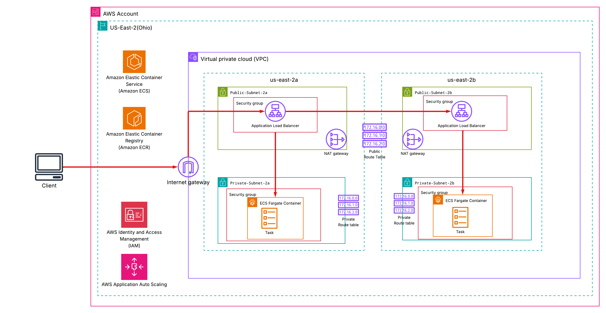
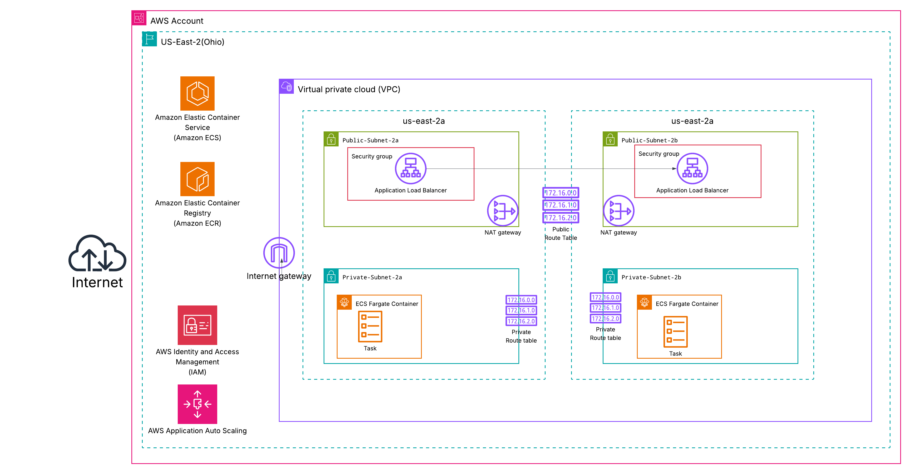
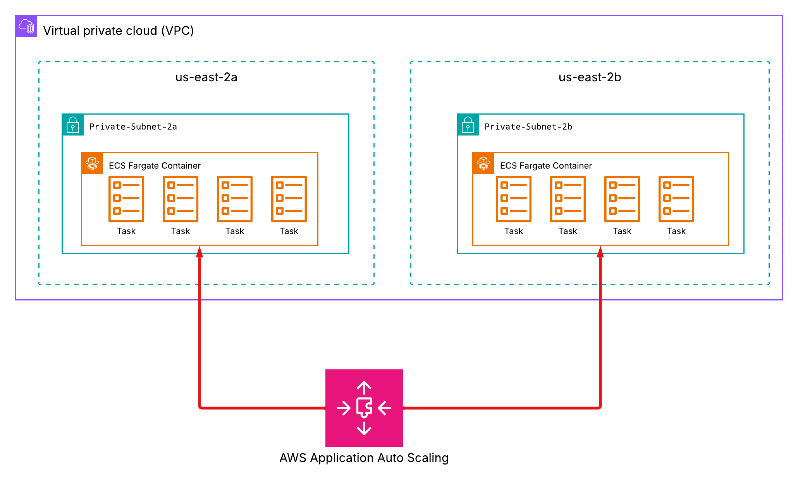

# aws-ecs-fargate-project




Containerized a web app and deployed it to AWS ECS Fargate using Terraform for IAC and Github Actions for continous integration and continious deployment. 

## Why I built this

After earning certifications in AWS SAA and Terraform Associate, I wanted to apply my skills by building something real. Certifications show that you understand the material, while projects demonstrate your ability to put that knowledge into practice. I've found that I retain information best when I actively apply it, so this project was designed to reinforce my learning while also serving as portfolio piece. A friend also needed help deploying their project to AWS, so I decided to kill two birds with one stone.

## How it's made
The first thing I did was get the app running locally using the documentation my friend gave me. The project was always running on localhost:4000, and I wasn't sure why at first, but after inspecting server.ts, I found an if statement that checks whether a port environment variable is defined and falls back to 4000 if not. Since I just cloned his repo without setting the env var, port 4000 was the default. I wanted to simulate a production deployment, so I planned to run the app on ECS rather than just locally, which meant containerizing it. I had some prior Docker experience and played around with it, but I wasn't fully sure how to containerize this specific app, so I worked through a Docker course on Udemy and read the Docker documentation. I ended up with the following DockerFile: 

```dockerfile
FROM node:20-alpine

WORKDIR /app

COPY package*.json ./

RUN npm install

COPY . .

RUN npm run build

EXPOSE 4000

CMD ["node", "dist/chip8_emulator/server/server.mjs"]
```

The base image pulls a specific Node version for compatibility. The Working directory gets set to /app, and then all packages are copied, and dependencies are installed. The project builds, port 4000 is exposed, and the server script is run.
After I got the Dockerfile up and running, I wanted to test the image in a more realistic environment. I manually created an ECR repository, pushed the image up, and spun up a small ECS cluster with a task definition referencing the image. It ran successfully, giving me the confidence to start building the real infrastructure.

### Building out the Infrastructure
I knew I couldn’t leave every Fargate task exposed to the internet. Not only is that a security risk, but it’s also impractical because if a task fails and is replaced, its IP address changes, requiring you to update it each time to access the service. Instead, I placed the tasks behind an ALB (Application Load Balancer). This way, the ALB serves as the only public entry point, while the tasks themselves run in private subnets and are accessible only through the load balancer. Unlike individual tasks, the ALB provides a stable endpoint that doesn’t change, making the setup far more reliable.

From there, I built the infrastructure piece by piece:
* Virtual Private Cloud (VPC) - Contains 4 subnets: a public and private subnet in us-east-2a, and a public and private subnet in us-east-2b
* Internet Gateway (IGW)  - Allows traffic from the VPN to reach the internet. 
* Applicatoin Load Balancer (ALB) - Spans the public subnets across both availability zones.
* NAT Gateways - One in each public subnet, allowing private subnets to access the internet while keeping traffic within their respective availability zones and improving availability.
* Route Tables - A shared public route table routes 0.0.0.0/0 to the IGW, while each private subnet has its own route table routing 0.0.0.0/0 to its local NAT Gateway.
* ECS Cluster, Fargate Service, and task definitions define and run the containerized app. 
* ECS Task Execution Role- Allows the task to authenticate with ECR and pull the container image.
* Security Groups – Configured for both the ALB and ECS service so that only the ALB can communicate with the tasks.





After creating the core infrastructure, I added autoscaling so the ECS service could automatically handle increased load. I used Application Auto Scaling with a target tracking policy configured to maintain average CPU utilization at 70%, allowing the service to scale between 1 and 4 tasks. One important adjustment was updating the ECS service lifecycle configuration to ignore changes to desired_count, so Terraform wouldn’t overwrite scaling actions performed by Application Auto Scaling during the next apply. Without this, Terraform could attempt to revert the task count based on the state file. The same applies to the task definition file.

Here's an example of how that process works: 





### Automating deployment with Github Actions

The GitHub Actions workflow is set up so that every push to master automatically deploys the changes to ECS. The job runs on an Ubuntu runner. First, it clones the repo, then authenticates with AWS using credentials stored as GitHub repo secrets (This requires creating an IAM User, granting it sufficient permissions, and adding its access keys to GitHub). Now authenticated, the runner connects to the private ECR repo, builds the Docker image, and pushes it. Each image is tagged with a unique hash, and then re-tagged as :latest because the task definition references the :latest tag. And the final step deploys the new image to ECS. AWS recommends keeping the task-definition.json file committed to the repo as code, in case you want to make changes to it later. To populate it the first time, after the initial Terraform apply and the first successful CI deploy, I ran the following command:
```bash
aws ecs describe-task-definition \
   --task-definition my-task-definition-family \
   --query taskDefinition > task-definition.json
```
Then, I pushed the file to master. From that point onward, every push to master automatically deploys to ECS. Pretty cool, right? 

Here's an example of how that looks. 


## Lessons Learned:

Terraform does not recognize changes made outside of its state file. If modifications are made directly to AWS infrastructure outside of Terraform, Terraform will treat them as configuration drift and attempt to revert them during the next apply so that the actual infrastructure matches the state file. As a result, any changes introduced by GitHub Actions or Application Auto Scaling may be overwritten. That's why it's crucial to include the lifecycle block ignore_changes with the required arguments.

Although the ECR repository is private, accessing its images still requires outbound internet connectivity. If the resources are in a private subnet, it’s probably easier to set up a NAT GW to handle this. At first, only one NAT Gateway was configured, which caused traffic from the second private subnet in AZ-b to route through AZ-a, creating a single point of failure and preventing resources in private subnet 2b from accessing the internet if AZ-a went down. In order to improve availability and resilience, I simply added another NAT GW to the other AZ, so that each AZ had its own NAT GW.

The Application Auto Scaling service relies on CloudWatch metrics by default and does not require additional configuration to enable monitoring. Since the underlying infrastructure is already integrated with CloudWatch, no further changes to the VPC are necessary to collect container-level metrics. I found this quite interesting when reading the documentation about Application Auto Scaling, and it makes me wonder what other AWS services use other AWS services under the hood to get the job done.


